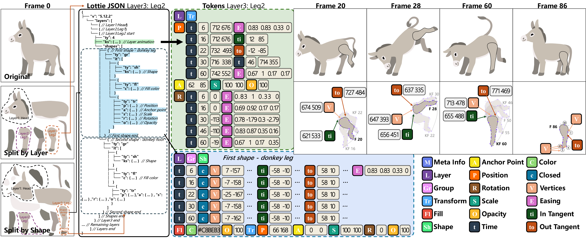

<div align="center">

<h1>LottieGPT</h1>

**Tokenizing Vector Animation for Autoregressive Generation**


**[Junhao Chen](https://scholar.google.com/citations?hl=en&user=uVMnzPMAAAAJ)<sup>1\*</sup>**, **[Kejun Gao](https://scholar.google.com/scholar?q=Kejun+Gao)<sup>1\*</sup>**, **[Yuehan Cui](https://scholar.google.com/scholar?q=Yuehan+Cui)<sup>1</sup>**, **[Mingze Sun](https://scholar.google.com/citations?user=TTW2mVoAAAAJ&hl=en)<sup>1</sup>**, **[Mingjin Chen](https://scholar.google.com/citations?user=uLfubbgAAAAJ&hl=en&oi=sra)<sup>3</sup>**  
**[Shaohui Wang](https://scholar.google.com/scholar?q=Shaohui+Wang)<sup>1</sup>**, **[Xiaoxiao Long](https://scholar.google.com/citations?hl=en&user=W3G5kZEAAAAJ)<sup>4</sup>**, **[Fei Ma](https://scholar.google.com/citations?user=RJOEAMYAAAAJ&hl=zh-CN)<sup>5</sup>**, **[Qi Tian](https://scholar.google.com/citations?hl=en&user=61b6eYkAAAAJ)<sup>5</sup>**, **[Ruqi Huang](https://scholar.google.com/citations?user=cgRY63gAAAAJ&hl=en)<sup>1†</sup>**, **[Hao Zhao](https://scholar.google.com/citations?user=ygQznUQAAAAJ&hl=en)<sup>1,2†</sup>**

<sup>1</sup> Tsinghua University <sup>2</sup> BAAI 
<sup>3</sup> The Hong Kong Polytechnic University  
<sup>4</sup> Nanjing University 
<sup>5</sup> Guangming Lab

[](https://arxiv.org/abs/2604.11792)
[](https://arxiv.org/pdf/2604.11792)
[](https://lottiegpt.github.io/)
[](https://github.com/yisuanwang/LottieGPT)

</div>

---

## Overview

LottieGPT is a model for generating editable vector animations in an autoregressive manner. Instead of producing fixed-resolution raster frames, it tokenizes vector animation structure and motion, enabling high-quality generation that remains editable after synthesis.



This repository accompanies our paper and project page, and serves as a lightweight open-source hub for the paper, figures, and demo materials.

## Highlights

- **LottieImage-15M**: a large-scale vector animation dataset with 15M samples
- **Editable outputs**: generated animations can be directly edited at the shape and motion level
- **Autoregressive tokenization**: vector animation is modeled as a learnable token sequence
- **Multi-modal conditioning**: supports text, image, and keyframe-based generation

## 📑 Open-source Plan

- ☑️ Project Page & Technical Report
- ☐ LottieImage-15M & LottieAnimation-660K Dataset Release
- ☐ Inference Code & Model Weight
- ☐ Online Demo
- ☐ LottieBench Benchmark
- ☐ Training Code

## Paper Links

- **Paper:** LottieGPT: Tokenizing Vector Animation for Autoregressive Generation
- **arXiv:** https://arxiv.org/abs/2604.11792
- **PDF:** https://arxiv.org/pdf/2604.11792
- **Project Page:** https://lottiegpt.github.io/

## Repository Contents

This repository contains the materials used for the paper and the project page, including:

- project page source and assets
- paper figures and supplementary visuals
- demo materials and supporting resources
- author information and citation details

## Citation

If you use LottieGPT in your work, please cite:

```bibtex
@misc{chen2026lottiegpttokenizingvectoranimation,
  title={LottieGPT: Tokenizing Vector Animation for Autoregressive Generation},
  author={Junhao Chen and Kejun Gao and Yuehan Cui and Mingze Sun and Mingjin Chen and Shaohui Wang and Xiaoxiao Long and Fei Ma and Qi Tian and Ruqi Huang and Hao Zhao},
  year={2026},
  eprint={2604.11792},
  archivePrefix={arXiv},
  primaryClass={cs.CV},
  url={https://arxiv.org/abs/2604.11792},
}
```

## License

Please refer to the accompanying paper and project materials for usage and licensing information.
