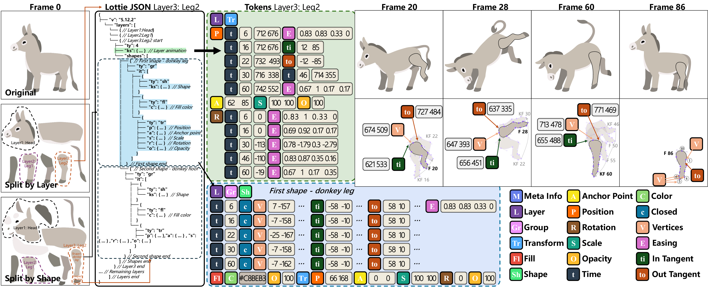

<div align="center">

<h1>LottieGPT</h1>

**Tokenizing Vector Animation for Autoregressive Generation**

<i>CVPR 2026</i>

**[Junhao Chen](https://scholar.google.com/citations?hl=en&user=uVMnzPMAAAAJ)<sup>1\*</sup>**, **[Kejun Gao](https://scholar.google.com/scholar?q=Kejun+Gao)<sup>1\*</sup>**, **[Yuehan Cui](https://scholar.google.com/scholar?q=Yuehan+Cui)<sup>1</sup>**, **[Mingze Sun](https://scholar.google.com/citations?user=TTW2mVoAAAAJ&hl=en)<sup>1</sup>**, **[Mingjin Chen](https://scholar.google.com/citations?user=uLfubbgAAAAJ&hl=en&oi=sra)<sup>3</sup>**  
**[Shaohui Wang](https://scholar.google.com/scholar?q=Shaohui+Wang)<sup>1</sup>**, **[Xiaoxiao Long](https://scholar.google.com/citations?hl=en&user=W3G5kZEAAAAJ)<sup>4</sup>**, **[Fei Ma](https://scholar.google.com/citations?user=RJOEAMYAAAAJ&hl=zh-CN)<sup>5</sup>**, **[Qi Tian](https://scholar.google.com/citations?hl=en&user=61b6eYkAAAAJ)<sup>5</sup>**, **[Ruqi Huang](https://scholar.google.com/citations?user=cgRY63gAAAAJ&hl=en)<sup>1†</sup>**, **[Hao Zhao](https://scholar.google.com/citations?user=ygQznUQAAAAJ&hl=en)<sup>1,2†</sup>**

<sup>1</sup> Tsinghua University <sup>2</sup> BAAI 
<sup>3</sup> The Hong Kong Polytechnic University  
<sup>4</sup> Nanjing University 
<sup>5</sup> Guangming Lab

[](https://arxiv.org/abs/2604.11792)
[](https://arxiv.org/pdf/2604.11792)
[](https://openaccess.thecvf.com/content/CVPR2026/html/Chen_LottieGPT_Tokenizing_Vector_Animation_for_Autoregressive_Generation_CVPR_2026_paper.html)
[](https://lottiegpt.github.io/)
[](https://github.com/yisuanwang/LottieGPT)

[](https://huggingface.co/datasets/LottieGPT/LottieSVG-10M)
[](https://huggingface.co/datasets/LottieGPT/LottieAnimation-660K)
[](https://creativecommons.org/licenses/by-nc-sa/4.0/)

</div>

---

## 🔥 News

- **[Jun 2026]** 🎉 We release the **largest-scale vector graphics and animation datasets to date**, all with **detailed text captions**. The two releases together cover three modalities — raw **SVG**, **static Lottie**, and **animated Lottie**:
  - **[LottieSVG-10M](https://huggingface.co/datasets/LottieGPT/LottieSVG-10M)** — the largest SVG / static-Lottie dataset to date (9,778,526 samples).
  - **[LottieAnimation-660K](https://huggingface.co/datasets/LottieGPT/LottieAnimation-660K)** — the largest and most diverse real-world vector animation dataset to date (660K animations).
- **[Apr 2026]** 📄 LottieGPT (**CVPR 2026**) is available on arXiv, together with the project page and technical report.

## Overview

LottieGPT is a model for generating editable vector animations in an autoregressive manner. Instead of producing fixed-resolution raster frames, it tokenizes vector animation structure and motion, enabling high-quality generation that remains editable after synthesis.



This repository accompanies our paper and project page, and serves as a lightweight open-source hub for the paper, figures, and demo materials.

## Highlights

- **LottieSVG-10M**: the largest SVG dataset to date — 9,778,526 SVGs, each paired with its converted static Lottie JSON, a rendered PNG, a detailed text caption, keyword tags, and metadata
- **LottieAnimation-660K**: the largest and most diverse real-world vector animation dataset to date — 660K animated Lottie files with MP4 previews, full Lottie JSON, detailed text captions, and tags
- **Detailed text captions**: every SVG, static Lottie, and animation is annotated with a rich natural-language description (objects, colors, positions, actions, and overall layout)
- **Editable outputs**: generated animations can be directly edited at the shape and motion level
- **Autoregressive tokenization**: vector animation is modeled as a learnable token sequence
- **Multi-modal conditioning**: supports text, image, and keyframe-based generation

## 📦 Datasets

We release the **largest-scale vector graphics and animation datasets to date**, all with **detailed text captions**. Together, the two releases span three modalities — raw **SVG**, **static Lottie**, and **animated Lottie**.

| Dataset | Scale | Per-sample contents | Link |
| :-- | :-- | :-- | :-- |
| **LottieSVG-10M** | 9,778,526 SVGs | SVG code · converted static Lottie JSON · rendered PNG · text caption · tags · metadata | [🤗 HuggingFace](https://huggingface.co/datasets/LottieGPT/LottieSVG-10M) |
| **LottieAnimation-660K** | 660K animations | full Lottie JSON · MP4 preview · text caption · tags | [🤗 HuggingFace](https://huggingface.co/datasets/LottieGPT/LottieAnimation-660K) |

**LottieSVG-10M** is the largest SVG / static-vector dataset to date. Each of its 9,778,526 samples provides the original SVG code, the SVG converted into a (static) Lottie JSON, a rendered PNG preview, a detailed natural-language caption, keyword tags, and metadata (size, style, asset type). It covers both the **SVG dataset** and the **static Lottie image dataset**, since every SVG ships together with its converted static Lottie. The release is sharded for large-scale training (100 metadata `.jsonl.zst` shards + 100 image `.tar.zst` shards, ~92 GB total).

**LottieAnimation-660K** is the largest and most diverse real-world vector animation dataset to date. It contains 660K Lottie animations curated from After Effects (Bodymovin) exports, with extensive cleaning, standardization, and JSON simplification. Each sample ships with the full Lottie JSON, an MP4 preview for quick inspection, a detailed caption, and tags.

**Captions.** All captions are detailed descriptions generated with Qwen2.5-VL, covering the objects involved, their colors and positions, the actions/motion, and the overall layout — making the data directly usable for text-to-vector and text-to-animation training.

> Both datasets are released under **CC BY-NC-SA 4.0** for academic and non-commercial research. See each dataset card for the full disclaimer and usage terms.

## 📑 Open-source Plan

- [x] Project Page & Technical Report
- [x] LottieSVG-10M & LottieAnimation-660K Dataset Release
- [ ] Inference Code & Model Weight
- [ ] Online Demo
- [ ] LottieBench Benchmark
- [ ] Training Code

## Paper Links

- **Paper:** LottieGPT: Tokenizing Vector Animation for Autoregressive Generation (CVPR 2026)
- **CVPR Open Access:** https://openaccess.thecvf.com/content/CVPR2026/html/Chen_LottieGPT_Tokenizing_Vector_Animation_for_Autoregressive_Generation_CVPR_2026_paper.html
- **arXiv:** https://arxiv.org/abs/2604.11792
- **PDF:** https://arxiv.org/pdf/2604.11792
- **Project Page:** https://lottiegpt.github.io/
- **GitHub:** https://github.com/yisuanwang/LottieGPT
- **Datasets:** [LottieSVG-10M](https://huggingface.co/datasets/LottieGPT/LottieSVG-10M) · [LottieAnimation-660K](https://huggingface.co/datasets/LottieGPT/LottieAnimation-660K)

## Repository Contents

This repository contains the materials used for the paper and the project page, including:

- project page source and assets
- paper figures and supplementary visuals
- demo materials and supporting resources
- author information and citation details

## Citation

If you use LottieGPT or our datasets in your work, please cite:

```bibtex
@InProceedings{Chen_2026_CVPR,
  author    = {Chen, Junhao and Gao, Kejun and Cui, Yuehan and Sun, Mingze and Chen, Mingjin and Wang, Shaohui and Long, Xiaoxiao and Ma, Fei and Tian, Qi and Zhao, Hao and Huang, Ruqi},
  title     = {LottieGPT: Tokenizing Vector Animation for Autoregressive Generation},
  booktitle = {Proceedings of the IEEE/CVF Conference on Computer Vision and Pattern Recognition (CVPR)},
  month     = {June},
  year      = {2026},
  pages     = {31639-31651}
}
```


## License

The code and project materials in this repository are released for academic and non-commercial research use. The **LottieSVG-10M** and **LottieAnimation-660K** datasets are released under the **Creative Commons Attribution-NonCommercial-ShareAlike 4.0 International License (CC BY-NC-SA 4.0)**; please refer to each dataset card for full usage and licensing terms.
